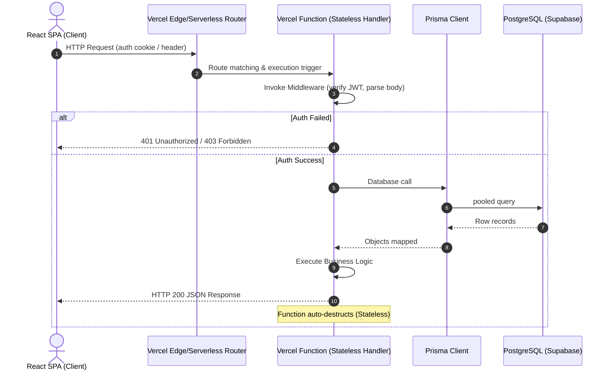

# DBC Serverless Migration Blueprint

This document details the transition of the **DBC** backend from a Java Spring Boot monolithic architecture to a serverless-first, typescript-based architecture deployed on **Vercel** with **Prisma ORM** and **PostgreSQL**.

---

## 1. System Architecture

Below is the request lifecycle for DBC Serverless:



---

## 2. Production-Ready Folder Structure

We will restructure the project into a **unified Vercel project structure**. The React frontend will reside in the root and `/src`, while backend serverless handlers reside inside `/api`:

```text
DBC/
├── api/                   # Vercel Serverless Functions
│   ├── auth/
│   │   ├── register.ts    # POST /api/auth/register
│   │   ├── login.ts       # POST /api/auth/login
│   │   └── logout.ts      # POST /api/auth/logout
│   ├── profile/
│   │   └── index.ts       # GET/PUT /api/profile
│   ├── categories/
│   │   └── index.ts       # GET /api/categories
│   ├── search/
│   │   └── index.ts       # GET /api/search
│   ├── bookings/
│   │   ├── index.ts       # GET/POST /api/bookings
│   │   └── [id].ts        # PATCH /api/bookings/:id
│   ├── consultations/
│   │   └── index.ts       # GET/POST /api/consultations
│   ├── subscriptions/
│   │   ├── plans.ts       # GET /api/subscriptions/plans
│   │   └── purchase.ts    # POST /api/subscriptions/purchase
│   ├── portfolio/
│   │   └── index.ts       # GET/POST/DELETE /api/portfolio
│   └── reviews/
│       └── index.ts       # POST/DELETE /api/reviews
├── prisma/                # Prisma DB Configuration
│   ├── schema.prisma      # DB schema definition
│   ├── seed.ts            # Roles & Categories database seeder
│   └── migrations/        # Auto-generated SQL migration scripts
├── src/                   # React Frontend Source (Vite SPA)
│   ├── assets/
│   ├── components/
│   ├── store/             # Redux State Management
│   ├── services/          # Frontend API Client Services
│   ├── pages/
│   ├── App.tsx
│   └── main.tsx
├── package.json           # Unified package dependencies
├── tsconfig.json
├── vite.config.ts
└── vercel.json            # Vercel deployment configurations
```

---

## 3. Prisma Schema Design

Below is the complete `prisma/schema.prisma` file containing all structural constraints and relationships required for DBC:

```prisma
datasource db {
  provider = "postgresql"
  url      = env("DATABASE_URL")
}

generator client {
  provider = "prisma-client-js"
}

enum Role {
  CUSTOMER
  PROFESSIONAL
  CONSULTANT
  ADMIN
}

enum UserStatus {
  ACTIVE
  INACTIVE
  SUSPENDED
}

enum VerificationStatus {
  PENDING
  VERIFIED
  REJECTED
}

enum BookingStatus {
  PENDING
  CONFIRMED
  COMPLETED
  CANCELLED
}

enum PaymentType {
  SUBSCRIPTION
  LISTING_FEE
  BOOKING
}

enum PaymentStatus {
  PENDING
  SUCCESS
  FAILED
}

enum TargetType {
  PROFESSIONAL
  CONSULTANT
}

model User {
  id                  String             @id @default(uuid())
  email               String             @unique
  password            String
  role                Role               @default(CUSTOMER)
  status              UserStatus         @default(ACTIVE)
  createdAt           DateTime           @default(now())
  updatedAt           DateTime           @updatedAt

  customerProfile     CustomerProfile?
  professionalProfile ProfessionalProfile?
  consultantProfile   ConsultantProfile?
  userSubscriptions   UserSubscription[]
  payments            Payment[]
  notifications       Notification[]

  @@map("users")
}

model CustomerProfile {
  id              String             @id @default(uuid())
  userId          String             @unique
  user            User               @relation(fields: [userId], references: [id], onDelete: Cascade)
  fullName        String             @map("full_name")
  phoneNumber     String             @map("phone_number")
  address         String?
  city            String
  state           String
  pincode         String
  profileImageUrl String?            @map("profile_image_url")
  createdAt       DateTime           @default(now())
  updatedAt       DateTime           @updatedAt

  bookings        Booking[]
  consultations   ConsultationBooking[]
  favorites       Favorite[]
  reviews         Review[]

  @@map("customer_profiles")
}

model ProfessionalProfile {
  id                 String             @id @default(uuid())
  userId             String             @unique
  user               User               @relation(fields: [userId], references: [id], onDelete: Cascade)
  companyName        String             @map("company_name")
  ownerName          String             @map("owner_name")
  phoneNumber        String             @map("phone_number")
  experienceYears    Int                @map("experience_years")
  specialization     String
  serviceAreas       String?            @map("service_areas")
  description        String?
  verificationStatus VerificationStatus @default(PENDING) @map("verification_status")
  isFeatured         Boolean            @default(false) @map("is_featured")
  createdAt          DateTime           @default(now())
  updatedAt          DateTime           @updatedAt

  bookings           Booking[]
  portfolios         Portfolio[]
  favorites          Favorite[]

  @@map("professional_profiles")
}

model ConsultantProfile {
  id                 String             @id @default(uuid())
  userId             String             @unique
  user               User               @relation(fields: [userId], references: [id], onDelete: Cascade)
  specialization     String
  experienceYears    Int                @map("experience_years")
  bio                String?
  consultationFee    Float              @map("consultation_fee")
  ratingAverage      Float              @default(0.0) @map("rating_average")
  totalConsultations Int                @default(0) @map("total_consultations")
  verificationStatus VerificationStatus @default(PENDING) @map("verification_status")
  createdAt          DateTime           @default(now())
  updatedAt          DateTime           @updatedAt

  consultations      ConsultationBooking[]
  portfolios         Portfolio[]
  favorites          Favorite[]

  @@map("consultant_profiles")
}

model ServiceCategory {
  id          Int             @id @default(autoincrement())
  name        String          @unique
  slug        String          @unique
  categoryType String         @map("category_type") // BLUE_COLLAR or WHITE_COLLAR
  description String?
  imageUrl    String?         @map("image_url")
  parentId    Int?            @map("parent_id")
  createdAt   DateTime        @default(now())

  bookings    Booking[]

  @@map("service_categories")
}

model Booking {
  id             String             @id @default(uuid())
  customerId     String             @map("customer_id")
  customer       CustomerProfile    @relation(fields: [customerId], references: [id])
  professionalId String             @map("professional_id")
  professional   ProfessionalProfile @relation(fields: [professionalId], references: [id])
  categoryId     Int                @map("category_id")
  category       ServiceCategory    @relation(fields: [categoryId], references: [id])
  status         BookingStatus      @default(PENDING)
  scheduledDate  DateTime           @map("scheduled_date")
  notes          String?
  createdAt      DateTime           @default(now())
  updatedAt      DateTime           @updatedAt

  @@map("bookings")
}

model ConsultationBooking {
  id             String             @id @default(uuid())
  customerId     String             @map("customer_id")
  customer       CustomerProfile    @relation(fields: [customerId], references: [id])
  consultantId   String             @map("consultant_id")
  consultant     ConsultantProfile  @relation(fields: [consultantId], references: [id])
  status         BookingStatus      @default(PENDING)
  scheduledSlot  DateTime           @map("scheduled_slot")
  meetingLink    String?            @map("meeting_link")
  notes          String?
  createdAt      DateTime           @default(now())
  updatedAt      DateTime           @updatedAt

  @@map("consultation_bookings")
}

model SubscriptionPlan {
  id           Int                @id @default(autoincrement())
  name         String
  price        Float
  durationDays Int                @map("duration_days")
  description  String?
  features     Json?
  createdAt    DateTime           @default(now())

  subscriptions UserSubscription[]

  @@map("subscription_plans")
}

model UserSubscription {
  id        String           @id @default(uuid())
  userId    String           @map("user_id")
  user      User             @relation(fields: [userId], references: [id], onDelete: Cascade)
  planId    Int              @map("plan_id")
  plan      SubscriptionPlan @relation(fields: [planId], references: [id])
  status    String           @default("ACTIVE") // ACTIVE, EXPIRED
  startDate DateTime         @default(now()) @map("start_date")
  endDate   DateTime         @map("end_date")
  txRef     String?          @map("tx_ref")
  createdAt DateTime         @default(now())

  @@map("user_subscriptions")
}

model Payment {
  id          String        @id @default(uuid())
  userId      String        @map("user_id")
  user        User          @relation(fields: [userId], references: [id])
  amount      Float
  paymentType PaymentType   @map("payment_type")
  status      PaymentStatus @default(PENDING)
  txRef       String        @unique @map("tx_ref")
  createdAt   DateTime      @default(now())

  @@map("payments")
}

model Review {
  id         String          @id @default(uuid())
  customerId String          @map("customer_id")
  customer   CustomerProfile @relation(fields: [customerId], references: [id])
  targetId   String          @map("target_id")
  targetType TargetType      @map("target_type")
  rating     Int
  comment    String?
  createdAt  DateTime        @default(now())

  @@map("reviews")
}

model Notification {
  id        String   @id @default(uuid())
  userId    String   @map("user_id")
  user      User     @relation(fields: [userId], references: [id], onDelete: Cascade)
  title     String
  content   String
  isRead    Boolean  @default(false) @map("is_read")
  createdAt DateTime @default(now())

  @@map("notifications")
}

model Favorite {
  id             String               @id @default(uuid())
  customerId     String               @map("customer_id")
  customer       CustomerProfile      @relation(fields: [customerId], references: [id], onDelete: Cascade)
  professionalId String?              @map("professional_id")
  professional   ProfessionalProfile? @relation(fields: [professionalId], references: [id])
  consultantId   String?              @map("consultant_id")
  consultant     ConsultantProfile?   @relation(fields: [consultantId], references: [id])
  createdAt      DateTime             @default(now())

  @@map("favorites")
}

model Portfolio {
  id             String               @id @default(uuid())
  professionalId String?              @map("professional_id")
  professional   ProfessionalProfile? @relation(fields: [professionalId], references: [id])
  consultantId   String?              @map("consultant_id")
  consultant     ConsultantProfile?   @relation(fields: [consultantId], references: [id])
  title          String
  description    String
  projectType    String               @map("project_type")
  imageUrl       String?              @map("image_url")
  createdAt      DateTime             @default(now())
  updatedAt      DateTime             @updatedAt

  @@map("portfolios")
}

model Blog {
  id        String   @id @default(uuid())
  title     String
  slug      String   @unique
  content   String
  imageUrl  String?  @map("image_url")
  authorId  String   @map("author_id")
  createdAt DateTime @default(now())

  @@map("blogs")
}
